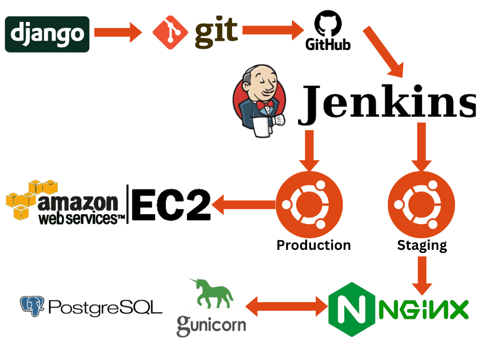

# Django Polls CI/CD

# Project Description

## Overview

This project is a Django-based web application managed through a continuous integration and deployment (CI/CD) pipeline using Jenkins. The workflow involves pushing code changes to a GitHub repository, triggering Jenkins to pull the code, build, and test it. Once successfully tested, the application is deployed first to a Staging Server and subsequently to a Production Server.

## Server Configuration

### 1. JenkinsServer

JenkinsServer is responsible for automating the CI/CD pipeline. It monitors the GitHub repository for changes, pulls the code, builds it, and executes tests. This server acts as the initial stage in the deployment process.

### 2. StagingServer

StagingServer serves as an intermediary step between development and production. It hosts the application for testing purposes and has Nginx and Gunicorn configured to serve the Django application efficiently. All testing is performed on this server before pushing changes to the ProductionServer.

### 3. ProductionServer

ProductionServer is the live environment where the finalized and tested code is deployed. It mirrors the configuration of the StagingServer to ensure consistency between the testing and production environments.

## Deployment Workflow

1. **Code Push to GitHub:**
   - Developers push code changes to the GitHub repository.

2. **Jenkins CI/CD Pipeline:**
   - JenkinsServer detects changes in the GitHub repository.
   - Jenkins pulls the latest code, builds the application, and runs tests.

3. **Staging Deployment:**
   - If tests pass, Jenkins deploys the application to the StagingServer.
   - Nginx and Gunicorn serve the application on the StagingServer for thorough testing.

4. **Testing on StagingServer:**
   - Developers perform extensive testing on the StagingServer to ensure the stability and functionality of the application.

5. **Production Deployment:**
   - After successful testing on the StagingServer, changes are pushed to the ProductionServer.
   - ProductionServer mirrors the configuration of the StagingServer to maintain consistency.

## How to Contribute

1. Fork the repository.
2. Create a feature branch: `git checkout -b feature/your-feature-name`.
3. Make changes and commit: `git commit -m "Add your changes"`.
4. Push to the branch: `git push origin feature/your-feature-name`.
5. Submit a pull request.

## Project Dependencies

- Django
- Nginx
- Gunicorn
- Jenkins
- VirtualBox (for server virtualization)

## Development Guidelines

- Follow the [PEP 8](https://www.python.org/dev/peps/pep-0008/) style guide for Python code.
- Write comprehensive unit and integration tests.
- Document your code and update the README.md file when adding new features or making significant changes.

## License

This project is licensed under the [MIT License](LICENSE).

